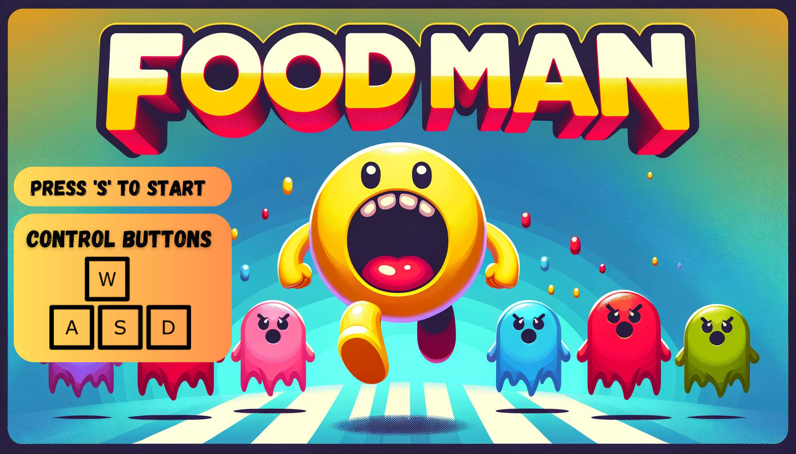
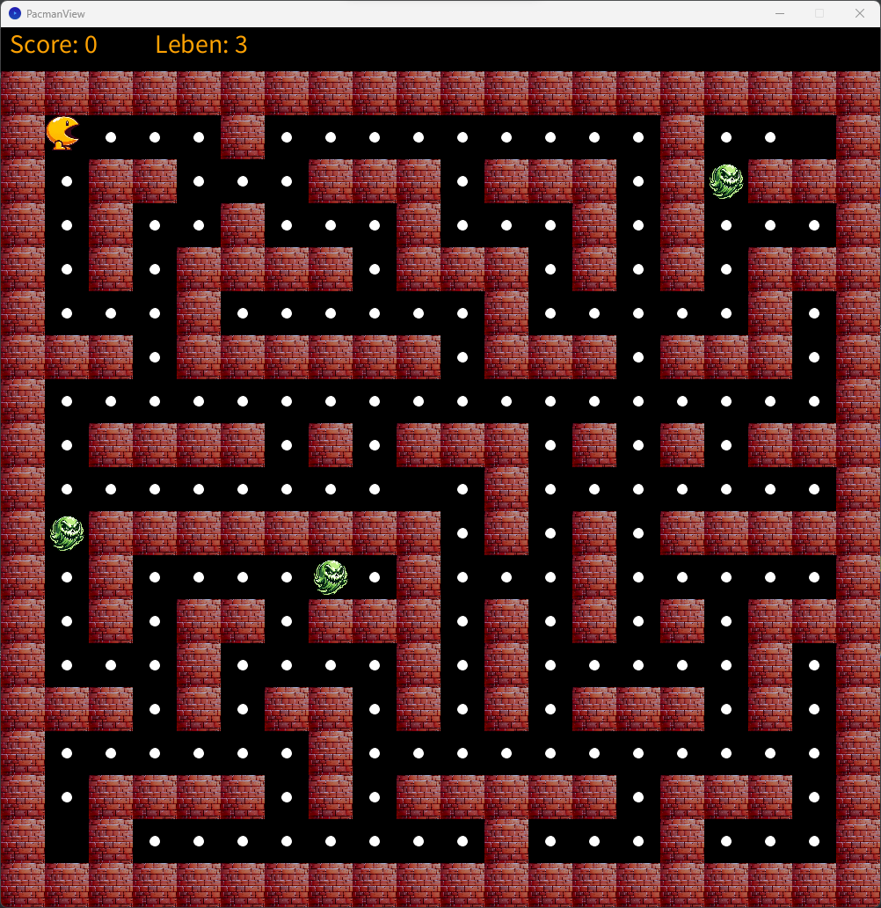
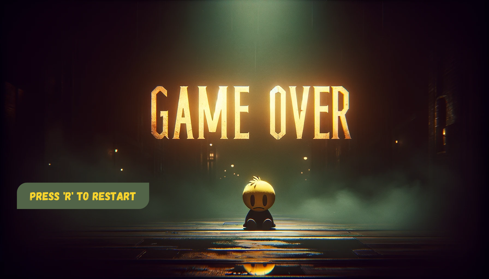
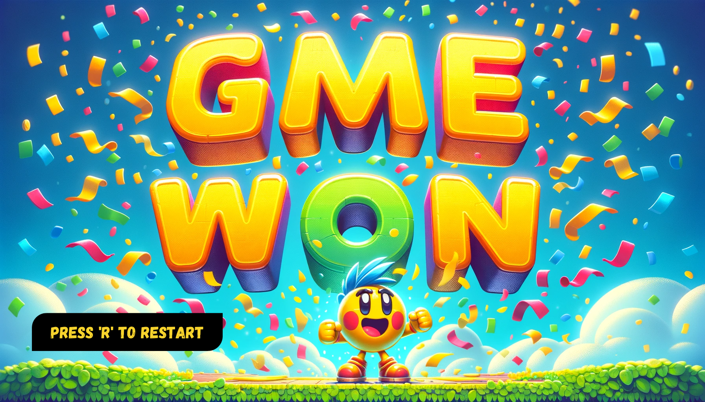

# FoodMan Game in Java

This README provides an overview of a Java-based Pacman game, featuring dynamic level loading, collision detection, and classic Pacman gameplay mechanics.

## Overview

This Java implementation of the classic game Pacman allows players to control Pacman, navigate through mazes, eat dots, and avoid ghosts.

## Dependencies and Sources

- **Processing**: A flexible software sketchbook and a language for learning how to code within the context of the visual arts. [Processing Website](https://processing.org/)
- **JUnit 5**: JUnit is a simple framework to write repeatable tests. It is an instance of the xUnit architecture for unit testing frameworks. [JUnit 5 Website](https://junit.org/junit5/docs/current/user-guide/)

## Screenshots
Pacman Title Screen


Pacman Game Play Screen


Pacman Game Over Screen


Pacman Game Win Screen



## Getting Started

### Running the Game

1. **Download the Source Code**: Download the source code from the [GitHub repository]()
2. **Open the Project**: Open the project in your favorite IDE (e.g. IntelliJ, Eclipse, etc.)
3. **Run the Game**: Run the game by running the `Main.java` file in the `src` folder.
4. **Play the Game**: Play the game by using the game controls listed below.

### Game Controls

- W: Move forward.
- A: Move left.
- S: Move backward.
- D: Move right.
- R: Restart the game.

## Testing in JShell


Test the Pacman model in JShell as follows:

1. **Start JShell**: Open JShell in your terminal.

2. **Load the Pacman Model**:
- path: out/production/Pacman
- put it in the classpath (path/to/your/classes).
   ```
      jshell --class-path path/to/your/classes
      
      jshell> import Pacman.model.*;  // Make sure this is correct and the classes are in the classpath
   ```
3. **Create an Instance**:
   ```
   jshell> PacmanModel model = new PacmanModel(800, 600);  // Create an instance of PacmanModel
   ```
4. **Simulate Game Actions**:
    - Move Pacman:
      ```
      jshell> model.movePacman('w');  // Simulate moving Pacman up
      ```
    - Update Game State:
      ```
      jshell> model.updateGame();  // Update the game state
      ```
5. **Check Game Status**:
   ```
   jshell> model.isGameOver();  // Returns true if the game is over
   ```

*Note: JShell tests individual components/methods and won't run the game with graphical elements.*

## Authors
- This project was created by [Taha Hussein].
- This project was created for [CS1016 Programmierung interaktiver Systeme] at [THM University] Under the supervision of Prof. Dr. Weigel.
- This project was created in the winter semester of 2023/24.

---